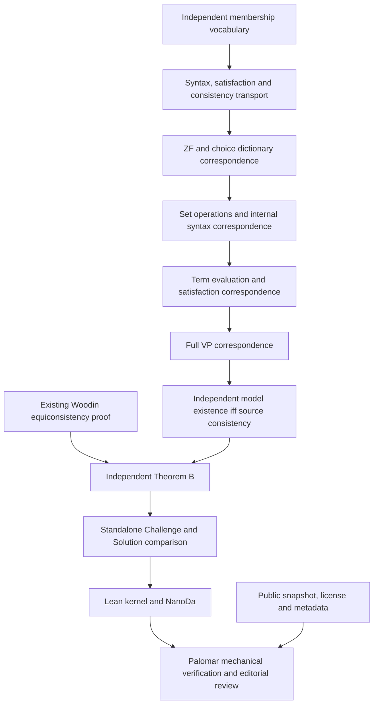

# Palomar and Comparator

There are two configurations. Comparator checks exact statements and their proof dependencies; Palomar adds import, metadata, licensing and editorial requirements.

| Configuration | Exact scope | Statement imports |
| --- | --- | --- |
| [comparator.json](../comparator.json) | Theorem A, Theorem B, the DC consistency consequence and the ordinary-real Solovay consistency consequence. | Existing Foundation and project encoding. This configuration does not satisfy Palomar's Challenge import policy. |
| [comparator-palomar-b.json](../comparator-palomar-b.json) | Theorem B: existence of a ZFC+VP model iff existence of a ZF+VP model, with proved equivalences to syntactic consistency. | Only mathlib. This is the Palomar submission candidate. |

No Palomar submission or registration has been made. The root license and public-visibility decision are pending. A completed Comparator/NanoDa run on the candidate is also required; compilation of its Lean proof is already recorded in [the bridge account](../PalomarBridge/README.md).

## Standalone statement and proved bridge

[PalomarChallenge.lean](../PalomarChallenge.lean) contains the entire vocabulary and one deliberate theorem hole. [PalomarSolution.lean](../PalomarSolution.lean) proves the same declaration, `VopenkaWithoutChoice.palomar_equiconsistency`, through `PalomarBridge.independent_theoremB`. No definition holes are used.

The vocabulary describes parameterized ZF schemes, choice, internally set-sized languages and structures, internal syntax and satisfaction, and full VP. Model domains need not be externally countable or well-founded. Elementary embeddings preserve all internally finite formulas, including nonstandard formulas in nonstandard models.

The standalone file is generated from [Vocabulary.lean](../PalomarBridge/Vocabulary.lean). The Solution imports that vocabulary normally. The Challenge includes its text because [Palomar's policy](https://github.com/PalomarRegistry/PalomarPolicy/blob/e9c8c238f5695b10f75db7175648a1d0195352c1/CONTRIBUTING.md) forbids project imports even through intermediate modules. Comparator checks the definitions in the two separate environments. The file is about 20 KB and 344 lines, below the hard limits of 100 KiB and 1,000 lines. Its length exceeds the 300-line advisory threshold.



The translation and independent Theorem B nodes are proved. Comparator/NanoDa and Palomar verification are separate steps. The two unmatched auxiliary V13 clauses are documented in [the formalization notes](../repairs/formalization/README.md); neither is silently added to this submission's claim. The other three principal result families remain available in the existing-encoding comparison. They are not registered by submitting the Theorem B configuration.

## Reproduce

```sh
python3 scripts/generate-palomar-challenge.py --check
python3 scripts/check-repository.py --config comparator-palomar-b.json
lake build ZFVP PalomarBridge Solution PalomarSolution
lake env lean verification/ExportChecks.lean
lake env lean verification/AdditionalChecks.lean
```

`python3 scripts/check-repository.py --config comparator-palomar-b.json --submission` also checks the known intake gates, including public visibility through `gh`. This preflight does not replace Palomar's verifier.

The [CI workflow](../.github/workflows/verify.yml) runs the pinned Comparator and NanoDa on both configurations, then the full root build and coverage compositions. It uses an unprivileged Linux service with the AF_UNIX restriction required by Comparator. Its artifacts preserve the output. On a Linux machine with the equivalent outer restriction, run `bash scripts/verify-comparator.sh comparator-palomar-b.json`. A fake Landrun wrapper does not reproduce that protected check.

The initial full source build may take time. Later CI runs can reuse source builds at matching dependency revisions; Lake rebuilds changed modules. Palomar performs its own clean verification of the submitted commit.

## Submit and register

The candidate configuration path is `comparator-palomar-b.json`; metadata is in the root `formalization.yaml`. Palomar requires a public repository, a standard root license and a full 40-character commit SHA. The pinned Lean v4.34.0-rc2 is above the recorded minimum v4.28.0, and lean4export matches the project's release.

The submission entry point is <https://submit.palomar-registry.org/>. Its `llms.txt` requires agreement on the exact repository, commit, configuration and declared author/maintainer relationship before agent intake. The documented `gh` flow creates a temporary Git tag and secret gist, verifies them, then removes both. Submission starts public mechanical checks. Registration is a separate permanent publication decision that includes the review and preservation forks.

The repository setup does not make that authorization declaration or consent to registration on the maintainer's behalf.
