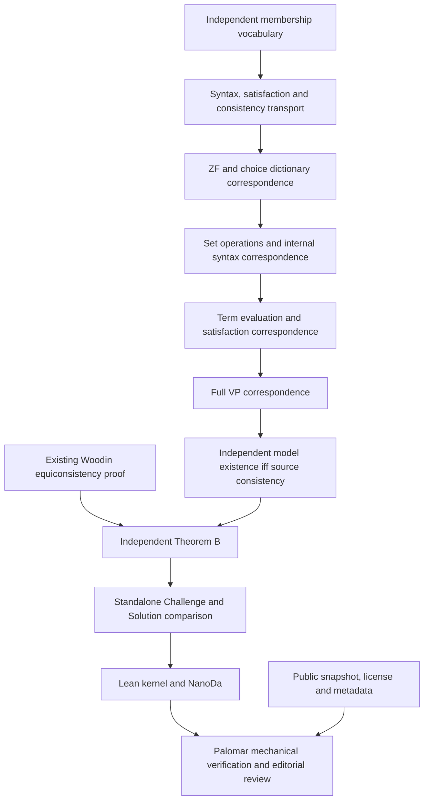

# Palomar and Comparator

There are five configurations. Comparator checks exact statements and their proof dependencies; Palomar adds import, metadata, licensing and editorial requirements.

| Configuration | Exact scope | Statement imports |
| --- | --- | --- |
| [comparator.json](../comparator.json) | Theorem A, Theorem B, the DC consistency consequence and the ordinary-real Solovay consistency consequence. | Existing Foundation and project encoding. This configuration does not satisfy Palomar's Challenge import policy. |
| [comparator-palomar-b.json](../comparator-palomar-b.json) | Theorem B: existence of a ZFC+VP model iff existence of a ZF+VP model, with proved equivalences to syntactic consistency. | Only mathlib. This is the Palomar submission candidate. |
| [comparator-palomar-a.json](../comparator-palomar-a.json) | Theorem A: the specified symmetric quotient exists and every presentation satisfies ZF + full VP. | Only mathlib. A separate Palomar submission candidate. |
| [comparator-palomar-dc.json](../comparator-palomar-dc.json) | Model existence for ZF + VP implies model existence for ZF + VP + DC + failure of AC. | Only mathlib. A separate Palomar submission candidate. |
| [comparator-palomar-solovay.json](../comparator-palomar-solovay.json) | The ordinary-real Solovay model-existence consequence, including its ultrafilter clause. | Only mathlib. A separate Palomar submission candidate. |

No Palomar submission or registration has been made. The root license and public-visibility decision are pending. A completed Comparator/NanoDa run on the candidate is also required; compilation of its Lean proof is already recorded in [the bridge account](../PalomarBridge/README.md).

## Standalone statement and proved bridge

[PalomarChallenge.lean](../PalomarChallenge.lean) contains the entire vocabulary and one deliberate theorem hole. [PalomarSolution.lean](../PalomarSolution.lean) proves the same declaration, `VopenkaWithoutChoice.palomar_equiconsistency`, through `PalomarBridge.independent_theoremB`. No definition holes are used.

The vocabulary describes parameterized ZF schemes, choice, internally set-sized languages and structures, internal syntax and satisfaction, and full VP. Model domains need not be externally countable or well-founded. Elementary embeddings preserve all internally finite formulas, including nonstandard formulas in nonstandard models.

The standalone file is generated from [Vocabulary.lean](../PalomarBridge/Vocabulary.lean). The Solution imports that vocabulary normally. The Challenge includes its text because [Palomar's policy](https://github.com/PalomarRegistry/PalomarPolicy/blob/e9c8c238f5695b10f75db7175648a1d0195352c1/CONTRIBUTING.md) forbids project imports even through intermediate modules. Comparator checks the definitions in the two separate environments. The file is about 20 KB and 344 lines, below the hard limits of 100 KiB and 1,000 lines. Its length exceeds the 300-line advisory threshold.



The translation and independent Theorem B nodes are proved. Comparator/NanoDa and Palomar verification are separate steps. The two unmatched auxiliary V13 clauses are documented in [the formalization notes](../repairs/formalization/README.md); neither is silently added to this submission's claim. Each configuration selects its own result; submitting Theorem B does not register another configuration.

## Symmetric preservation

[PalomarPreservationChallenge.lean](../PalomarPreservationChallenge.lean) includes the shared membership vocabulary and the explicit forcing definitions from [the preservation bridge](../PalomarPreservationBridge/README.md). It is 473 lines and 27,197 bytes. Its only import is mathlib. [PalomarPreservationSolution.lean](../PalomarPreservationSolution.lean) proves the matching declaration `VopenkaWithoutChoice.palomar_preservation`.

The statement supplies an internal poset, automorphism group, normal filter and a generic. It defines names, hereditary symmetry and atomic forcing through internal recursion. A quotient presentation has exactly the equality and membership relations determined by that generic. Existence of a presentation is proved, as is ZF + VP for every presentation. The extension's theory is not an assumption. No external countability or well-foundedness restriction is imposed on the ground.

The proof identifies the explicit definitions with the existing symmetric context, proves uniqueness of its presentation up to membership isomorphism, and transfers the existing preservation theorem. Both standalone vocabularies are generated by the same script; their proof-side versions remain ordinary imports.

## Dependent choice consequence

[PalomarDCChallenge.lean](../PalomarDCChallenge.lean) adds the explicit internal DC definition and failure of choice to the shared vocabulary. It is 363 lines and 20,430 bytes. [PalomarDCSolution.lean](../PalomarDCSolution.lean) proves `VopenkaWithoutChoice.palomar_dependent_choice`.

The [DC bridge](../PalomarDCBridge/README.md) proves the source-theory correspondence over arbitrary ZF models and the model-existence/consistency equivalence. The final implication composes the same existing Woodin and Cohen results as the root comparison. It does not add a countability restriction.

## Ordinary-real Solovay consequence

[PalomarSolovayChallenge.lean](../PalomarSolovayChallenge.lean) is 499 lines and 30,336 bytes. It combines the shared membership and DC vocabularies with explicit rational arithmetic, real cuts, measure and topological regularity, and the ultrafilter definition. Its only import is mathlib.

The [Solovay bridge](../PalomarSolovayBridge/README.md) proves correspondence to the entire existing `realSolovayTheory`. The target retains ZF, full VP, DC, failure of AC, Lebesgue measurability, the Baire property and the perfect set property for every internal set of ordinary reals, and an omega-one-complete nonprincipal ultrafilter on omega one. [PalomarSolovaySolution.lean](../PalomarSolovaySolution.lean) proves `VopenkaWithoutChoice.palomar_solovay_reals` by composing that correspondence with the existing consistency proof.

All four standalone Challenge files are below Palomar's hard size limits. They exceed its 300-line advisory threshold. Their definitions remain explicit; there are no Comparator definition holes.

## Reproduce

```sh
python3 scripts/generate-palomar-challenge.py --check
python3 scripts/check-repository.py --config comparator-palomar-b.json
python3 scripts/check-repository.py --config comparator-palomar-a.json
lake build ZFVP PalomarBridge PalomarPreservationBridge Solution PalomarSolution PalomarPreservationSolution PalomarDCSolution PalomarSolovaySolution
lake env lean verification/ExportChecks.lean
lake env lean verification/AdditionalChecks.lean
```

`python3 scripts/check-repository.py --config comparator-palomar-b.json --submission` also checks the known intake gates, including public visibility through `gh`. This preflight does not replace Palomar's verifier.

The [CI workflow](../.github/workflows/verify.yml) runs the pinned Comparator and NanoDa on all configurations, then the full root build and coverage compositions. It uses an unprivileged Linux service with the AF_UNIX restriction required by Comparator. Its artifacts preserve the output. On a Linux machine with the equivalent outer restriction, run `bash scripts/verify-comparator.sh comparator-palomar-b.json`. A fake Landrun wrapper does not reproduce that protected check.

The initial full source build may take time. Later CI runs can reuse source builds at matching dependency revisions; Lake rebuilds changed modules. Palomar performs its own clean verification of the submitted commit.

## Submit and register

The candidate configuration paths are `comparator-palomar-a.json`, `comparator-palomar-b.json`, `comparator-palomar-dc.json` and `comparator-palomar-solovay.json`; each is a separate submission and metadata is in the root `formalization.yaml`. Palomar requires a public repository, a standard root license and a full 40-character commit SHA. The pinned Lean v4.34.0-rc2 is above the recorded minimum v4.28.0, and lean4export matches the project's release.

The submission entry point is <https://submit.palomar-registry.org/>. Its `llms.txt` requires agreement on the exact repository, commit, configuration and declared author/maintainer relationship before agent intake. The documented `gh` flow creates a temporary Git tag and secret gist, verifies them, then removes both. Submission starts public mechanical checks. Registration is a separate permanent publication decision that includes the review and preservation forks.

The repository setup does not make that authorization declaration or consent to registration on the maintainer's behalf.
