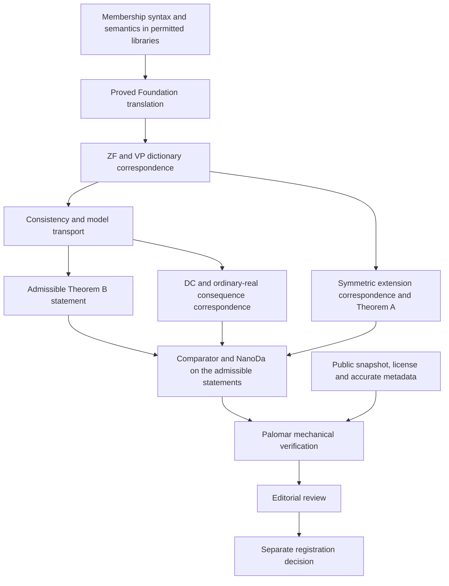

# Palomar preparation

The goal is a reproducible Palomar submission for the paper's principal results.
The repository is still in preparation. A local Comparator pass and Palomar
eligibility are different checks.

## Current interface

[Challenge.lean](../Challenge.lean) explicitly states symmetric preservation,
equiconsistency, the dependent-choice consistency consequence, and the
ordinary-real Solovay consistency consequence. [Solution.lean](../Solution.lean)
proves the same declarations using the existing development.
[comparator.json](../comparator.json) selects these four names and permits only
`propext`, `Quot.sound` and `Classical.choice`. Its definition-hole list is empty.
The four deliberate `sorry` terms are confined to Challenge; they are not proofs.
The Solution must pass both Comparator's Lean replay and NanoDa.

## Why this is not yet an admissible submission

[Palomar's policy](https://github.com/PalomarRegistry/PalomarPolicy/blob/e9c8c238f5695b10f75db7175648a1d0195352c1/CONTRIBUTING.md)
permits only Lean core, mathlib and the specifically approved libraries in the
Challenge's transitive imports. Foundation and this project's definitions are
not approved Challenge dependencies. The current statement imports them.

The required repair is mathematical interface work. A readable membership
syntax and satisfaction relation must be expressed using permitted libraries.
The ZF and VP axiom dictionaries must then be identified with the current
encoding by proved translation theorems, including consistency preservation.
For Theorem A, the symmetric-extension construction also needs an admissible
statement and a proved identification with the current model.

Replacing these concepts with unconstrained opaque definitions would conceal
the claim; it is not an acceptable workaround. The proof library itself can
continue using Foundation from the Solution side.

## Dependency order



The two unmatched auxiliary V13 clauses remain recorded in
[the formalization notes](../repairs/formalization/README.md). They must not be
silently included among the compared claims.

## Reproduce the checks

```sh
python3 scripts/check-repository.py --report .cache/verification/preflight.json
lake build ZFVP Solution
lake env lean verification/ExportChecks.lean
lake env lean verification/AdditionalChecks.lean
```

`python3 scripts/check-repository.py --submission` fails on the known intake
blockers. It is a local preflight, not a replacement for Palomar's verifier.

The [CI workflow](../.github/workflows/verify.yml) installs the pinned tools and
runs Comparator and NanoDa in an unprivileged Linux service with the AF_UNIX
restriction required by Comparator. It then builds the full root target and
checks the coverage compositions. Its artifacts preserve the run's output.
On a Linux machine with the equivalent outer restriction, run
`bash scripts/verify-comparator.sh`. Do not substitute a fake Landrun wrapper
and describe the result as the protected check.

## Submission and registration

Palomar requires a public GitHub repository, a standard root license, accurate
`formalization.yaml`, a supported toolchain, and a full 40-character commit SHA.
The selected configuration is `comparator.json`. The current Lean release is
above the recorded minimum, v4.28.0. The exporter pin matches v4.34.0-rc2.

The only submission entry point is <https://submit.palomar-registry.org/>.
An agent must first read its `llms.txt`, then follow the documented proof of
repository access and author authorization. Submission runs public mechanical
checks. Registration is a separate permanent publication step, including the
review and preservation forks. This repository has not been submitted or
registered by the preparation scripts.

The agent submission protocol requires agreement on the exact repository,
commit, configuration path and declared author/maintainer relationship before
intake. It uses a temporary Git tag and secret gist to prove access, then
removes both. The repository setup does not itself make that permanent
authorization declaration on the maintainer's behalf.
